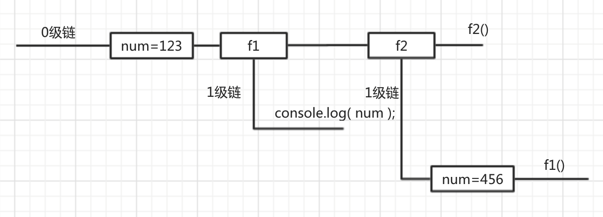

## 作用域链

### 什么是作用域链

只有函数可以制造作用域结构， 那么只要是代码，就至少有一个作用域, 即全局作用域。

凡是代码中有函数，那么这个函数就构成另一个作用域。如果函数中还有函数，那么在这个作用域中就又可以诞生一个作用域。

将这样的所有的作用域列出来，可以有一个结构: 函数内指向函数外的链式结构。就称作作用域链。

**例如：**

```js
function f1() {
    function f2() {
    }
}

var num = 456;
function f3() {
    function f4() {    
    }
}

```


### 绘制作用域链的步骤:

1. 看整个全局是一条链, 即顶级链, 记为 0 级链

2. 看全局作用域中, 有什么成员声明, 就以方格的形式绘制到 0 级练上

3. 再找函数, 只有函数可以限制作用域, 因此从函数中引入新链, 标记为 1 级链

4. 然后在每一个 1 级链中再次往复刚才的行为


### 变量的访问规则

* 首先看变量在第几条链上, 在该链上看是否有变量的定义与赋值, 如果有直接使用

* 如果没有到上一级链上找( n - 1 级链 ), 如果有直接用, 停止继续查找.

* 如果还没有再次往上刚找... 直到全局链( 0 级 ), 还没有就是 is not defined

* 注意,同级的链不可混合查找


#### 练习：绘制作用域链

```js
function f1() {
    var num = 123;
    function f2() {
        console.log( num );
    }
    f2();
}

var num = 456;
f1();
```


### 如何分析代码

1. 在分析代码的时候切记从代码的运行进度上来分析, 如果代码给变量赋值了, 一定要标记到图中
2. 如果代码比较复杂, 可以在图中描述代码的内容, 有事甚至需要将原型图与作用域图合并分析

#### 练习

```js
var num = 123;
function f1() {
    console.log( num );
}

function f2() {
    var num = 456;
    f1();
}
f2();
```


#### 练习

```js

var num = 123;

function f1() {
    console.log( num );
}

function f2() {
    num = 456;
    f1();
}

f2();
```
### 补充

<font color="red"> 声明变量使用`var`, 如果不使用`var`声明的变量就是全局变量( 禁用 )</font>

因为在任何代码结构中都可以使用该语法. 那么再代码维护的时候会有问题. 所以除非特殊原因不要这么用.

下面的代码的错误

```js
function foo () {
    var i1 = 1 // 局部
    i2 = 2, // 全局
    i3 = 3; // 全局
}

```


此时注意

```js
var arr = [];
for ( var i = 0; i < 10; i++ ) {
    arr.push( i );
}

for ( var i = 0; i < 10; i++ ) {
    console.log( arr[ i ] );
}

// 一般都是将变量的声明全部放到开始的位置, 避免出现因为提升而造成的错误
var arr = [],
i = 0;

for ( ; i < 10; i++ ) {
    arr.push( i );
}

for ( i = 0; i < 10; i++ ) {
    console.log( arr[ i ] );
}
```


