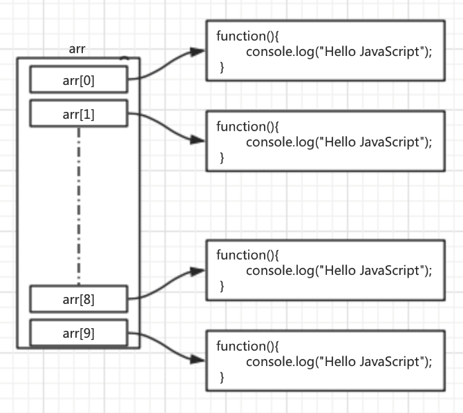
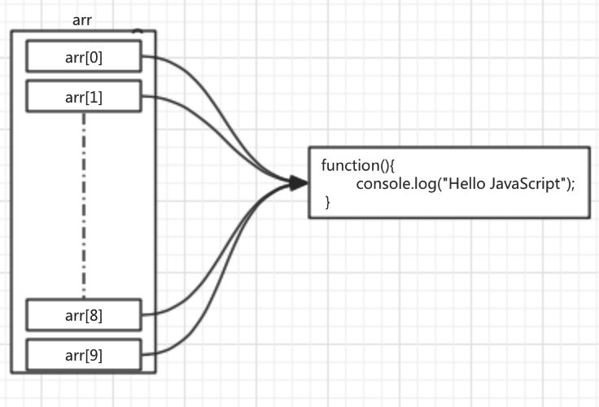

#对象/函数重复创建问题

##1. 发现问题：

首先分析如下代码：

```js
var arr = [];
for(var i = 0; i < 10; i++){
    arr.push({});
}
console.log(arr[0]==arr[1]);

```

由于每次循环都会使用`{}`创建一个新的对象，所以输出结果为`false`。


再分析如下代码：

```js
var arr = [];
for(var i = 0; i < 10; i++){
    arr.push(function(){
        console.log("Hello JavaScript");
    });
}
console.log(arr[0]==arr[1]);

```

跟第一段代码相似，每次循环都会创建一个新的函数，所以输出结果为`false`。





函数的功能就是用来封装一段代码，方便再次调用。同样功能的函数本来只需要创建一份就可以方便到处调用，但是在上面第二段代码中，被创建了多次，这样就造成了资源浪费。


我们期望的是如下图所示的情况：





##2. 解决方案

可以对上面第二段代码进行如下改进：

```js

//先定义该函数
function printOut(){
    console.log("Hello JavaScript");
}

var arr = [];
for(var i = 0; i < 10; i++){
    //在循环中，不重新创建函数，而是将已经存在的函数拿过来直接使用
    //也就是内存中只会有一份函数存在，每次push只是新增一个对该函数的引用而已
    arr.push(printOut);
}
console.log(arr[0]==arr[1]);

```

##3.实际应用

在实际开发当中，经常会有给多个元素注册同一个功能的时间处理函数的情况，如下：

**HTML代码**
```html
<div>div1</div>

<div>div2</div>

<div>div3</div>

<div>div4</div>
```

**JavaScript代码**

```js
var divs = document.getElementsByTagName("div");

for(var i = 0; i < divs.length; i++){
    var div = divs[i];
    div.addEventListener("click",function(){
        div.firstChild.nodeValue = "我被点击了";
    })
}

```

可以看到，上面用来注册事件代码的方式，会造成同一个功能的函数在内存中创建多个副本出来，这里暂时只有4个div，如果div的数量增加到100个，1000个，10000个，甚至1000000个呢？


所以需要对上面的代码进行优化，优化的思路就是我们在上面提到的，首先创建一个处理函数，然后在循环中直接使用已经创建好的函数即可，这样内存中就只有一份函数代码存在了。


**优化后的JavaScript代码**

```js

function divClick(){
    this.firstChild.nodeValue = "我被点击了";
}

var divs = document.getElementsByTagName("div");

for(var i = 0; i < divs.length; i++){
    var div = divs[i];
    div.addEventListener("click", divClick);
}

```


