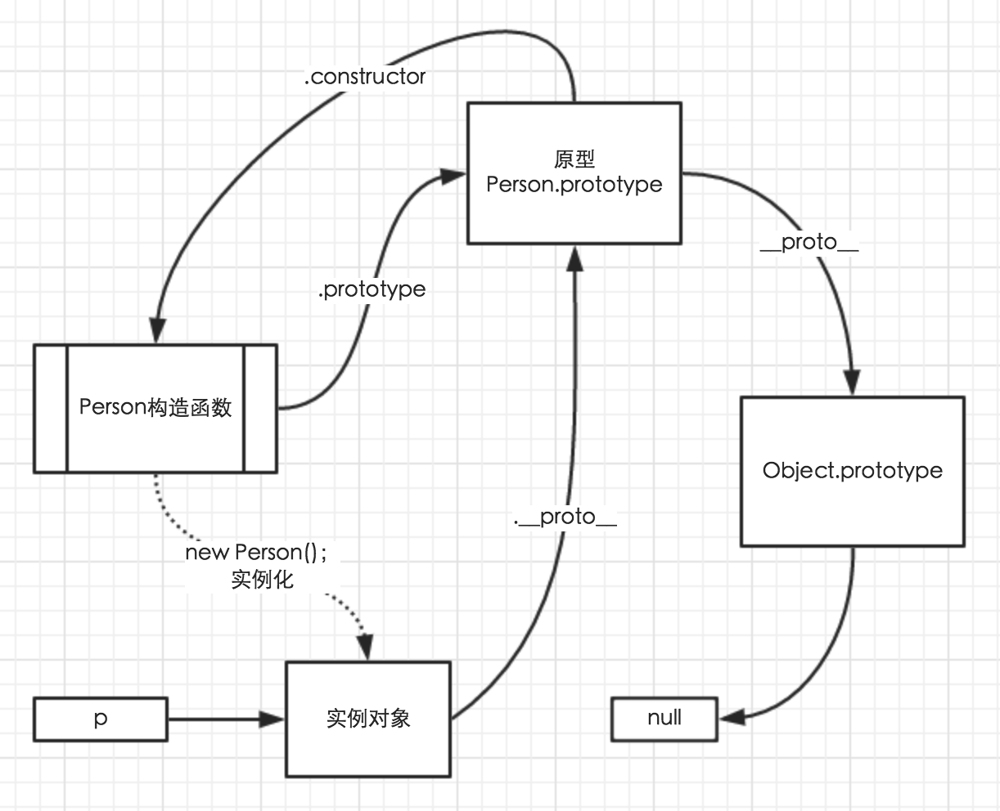

## 原型式继承
>观察：DOM对象的原型链

原型式继承就是利用修改原型链的结构( 增加一个节点, 删除一个节点, 修改节点中的成员 ), 来使得实例对象可以使用整条链中的所有成员.

## 绘制原型链结构

**注意**：函数也有`__proto__`属性，暂时不考虑这个！

观察如下代码，绘制相应的原型链结构图:

```js
function Person(){};
var p = new Person();
```

对应的原型链结构图为：



### 练习：
1. 绘制`{}`的原型链结构图
2. 绘制`[]`的原型链结构图

**注意**：

在 js 中, 所有的对象字面量在解析以后, 就是一个具体的对象了. 那么可以理解为 调用的 对应的构造方法.

* 例如在代码中写上 `{}`, 就相当于`new Object()`
* 例如代码中有 `[]`, 就相当于`new Array()`
* 例如代码中有 `/./`, 就相当于`new RegExp( '.' )`

注意: 在底层理论执行的过程中, 是否有调用构造函数, 不一定. 和浏览器的版本有关.

### 练习：

绘制如下代码的原型链结构:

```js
var o = {
    appendTo: function ( dom ) {
    }

};

function DivTag() {}

DivTag.prototype = o;
var div = new DivTag();

```
