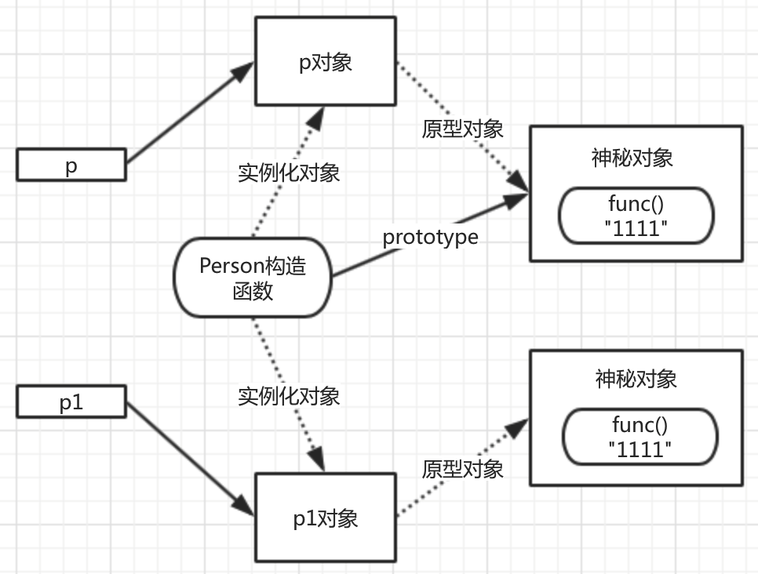

#原型的使用

##1. 使用对象的动态特性
```js
function Person () { }
Person.prototype.func = function () {
 console.log( 'something' );
};

var p = new Person();
p.func();

```

##2. 直接替换原型对象

```js

function Person () { };
Person.prototype = {
    func: function () {
        console.log( '22222' );
    }
};

var p = new Person();
p.func();

```


##3. 直接替换原型会出现的问题

```js

function Person () { }

Person.prototype.func = function () {
    console.log( 'something' );
};

var p = new Person();

Person.prototype.func = function () {
    console.log( 'something' );
};

var p1 = new Person();

p.func();

p1.func();

```

***替换原型之后，在替换前创建出来的对象和替换后创建出来的对象的原型对象不一致***


