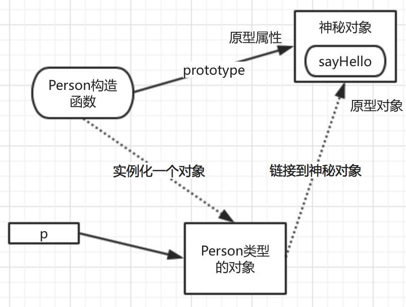

#原型相关的概念

##1. 神秘对象称与构造函数

* 神秘对象就是构造函数的 "原型属性"
* 简称原型 (构造函数的原型)

##2. 神秘对象与构造函数所创建出来的对象

* 神秘对象针对构造函数创建出来的对象称为 "原型对象"
* 简称原型 (对象的原型）

##3. 原型继承

* 构造函数创建的对象 继承自 构造函数的原型属性
* 构造函数创建的对象 继承自 该对象的原型对象
    * 原型中的成员, 可以直接被实例对象所使用
    * 实例对象直接 "含有" 原型中的成员
    * 因此实例对象 继承自 原型
    * 这样的继承就是 "原型继承"

